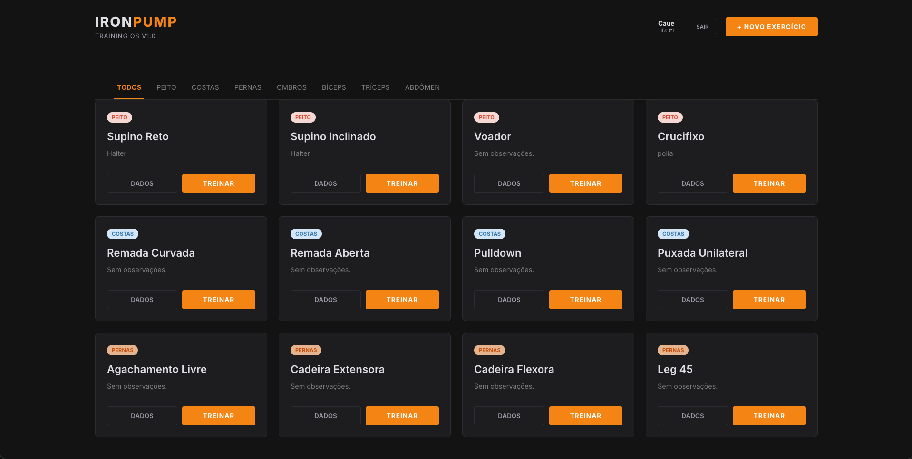
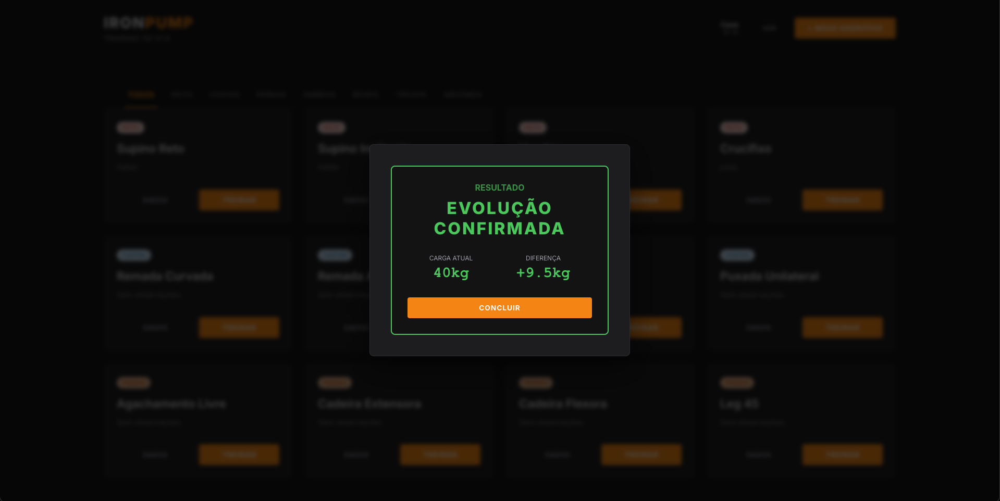
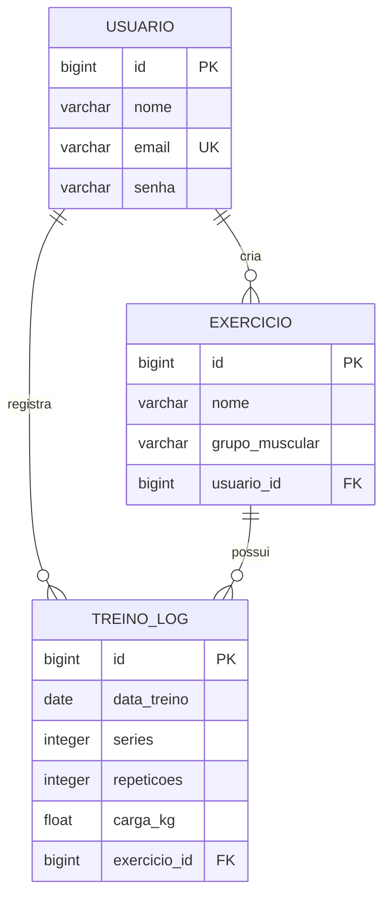

# 💪 IronPump – Sistema de Gestão de Treinos

<div align="center">


<p><b>Sistema fullstack para rastreamento, registro e análise de evolução de treinos de musculação.</b></p>

</div>

---

## 📸 Screenshots

<div align="center">
  
  <br>
  
</div>

---

## ✨ Funcionalidades

### 🎯 Principais
- **Autenticação:** Login e registro de usuários com persistência de sessão.
- **Gestão de Exercícios:** Cadastro personalizado de exercícios por grupo muscular.
- **Tracking de Treinos:** Registro detalhado de carga, séries e repetições.
- **Feedback Inteligente:** O sistema analisa automaticamente a evolução:
  - ✅ **Evolução:** Aumento de carga.
  - ⚠️ **Regressão:** Redução de carga.
  - ➡️ **Manutenção:** Carga mantida.
- **Histórico:** Visualização completa do progresso ao longo do tempo.

### 📱 Interface
- **Responsiva:** Adaptada para Desktop e Mobile.
- **Moderna:** Design inspirado em interfaces minimalistas.

---

## 🛠️ Tecnologias

### Backend
- **Java 21**
- **Spring Boot 4.0.0** (Web, Data JPA)
- **PostgreSQL 15**
- **Hibernate**
- **Maven & Lombok**

### Frontend
- **React 18**
- **TypeScript**
- **Vite**
- **CSS3 Customizado**

### DevOps & Infra
- **Docker & Docker Compose**
- **Nginx** (Proxy Reverso)

---

## 🚀 Como Rodar o Projeto

### Opção 1: Via Docker (Recomendado)

```bash
# 1. Clone o repositório
git clone [https://github.com/CauePrad0/ironpump-fullstack.git](https://github.com/CauePrad0/ironpump-fullstack.git)
cd ironpump-fullstack

# 2. Suba a aplicação completa
docker-compose up -d --build

# 3. Acesse:
# Frontend: http://localhost:3000
# Backend: http://localhost:8080
```

### Opção 2: Rodar Localmente

**Pré-requisitos:** Java 21, Node.js 18+, PostgreSQL (Porta 5433).

#### Backend
```bash
cd backend
# Configure o banco no application.properties se necessário
./mvnw spring-boot:run
```

#### Frontend
```bash
cd frontend
npm install
npm run dev
```

---

## 🗄️ Modelagem de Dados



---

## 📡 Endpoints da API

| Método | Endpoint | Descrição |
|--------|----------|-----------|
| `POST` | `/usuarios` | Cria um novo usuário |
| `POST` | `/usuarios/login` | Autentica usuário |
| `GET`  | `/exercicios` | Lista exercícios do usuário |
| `POST` | `/exercicios` | Cria novo exercício |
| `POST` | `/treinos` | Registra treino (c/ análise automática) |
| `GET`  | `/treinos/historico` | Busca histórico de evolução |

---

## 📁 Estrutura do Projeto

```
ironpump-fullstack/
│
├── backend/            # API Spring Boot
│   ├── src/main/java/com/ironpump/Ironpump/
│   │   ├── controller/
│   │   ├── model/
│   │   ├── service/
│   │   └── repository/
│   └── Dockerfile
│
├── frontend/           # Interface React
│   ├── src/
│   ├── nginx.conf
│   └── Dockerfile
│
└── docker-compose.yml  # Orquestração
```

---

---

## 👨‍💻 Autor

<div align="center">
  
**Caue Prado**

[](https://github.com/CauePrad0)

</div>
